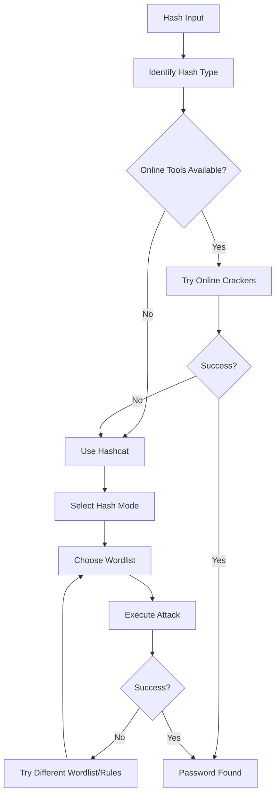

# TryHackMe Crack The Hash - Complete Walkthrough


## 📋 Table of Contents
- [Overview](#overview)
- [Hash Identification Tools](#hash-identification-tools)
- [Level 1: Online Decryption](#level-1-online-decryption)
- [Level 2: Hashcat Advanced](#level-2-hashcat-advanced)
- [Hash Types Reference](#hash-types-reference)
- [Key Learnings](#key-learnings)
- [Tools Used](#tools-used)

## 🎯 Overview
Crack The Hash introduces fundamental concepts of:
- **Hash identification** and analysis
- **Online decryption** tools and databases
- **Hashcat** usage for advanced cracking
- **Different hashing algorithms** (MD5, SHA1, SHA256, bcrypt, NTLM, etc.)
- **Salt-based hashing** and bypass techniques

## 🔍 Hash Identification Tools

### 🌐 Online Tools
- **Hash Analyzer:** [https://www.tunnelsup.com/hash-analyzer/](https://www.tunnelsup.com/hash-analyzer/)
- **HashID:** Command-line hash identification
- **Hash-identifier:** Alternative identification tool

### 💻 Command Line Tools
```bash
# Install hash identification tools
sudo apt install hashid hash-identifier

# Usage examples
hashid <hash_value>
hash-identifier
```

## 🌐 Level 1: Online Decryption

### Q1: `48bb6e862e54f2a795ffc4e541caed4d`
**🔍 Hash Type:** MD5 (32 characters, hexadecimal)  
**🛠️ Tool:** [https://10015.io/tools/](https://10015.io/tools/)  
**✅ Answer:** `easy`

### Q2: `CBFDAC6008F9CAB4083784CBD1874F76618D2A97`
**🔍 Hash Type:** SHA1 (40 characters, hexadecimal)  
**🛠️ Tool:** Online SHA1 decrypter  
**✅ Answer:** `password123`

### Q3: `1C8BFE8F801D79745C4631D09FFF36C82AA37FC4CCE4FC946683D7B336B63032`
**🔍 Hash Type:** SHA256 (64 characters, hexadecimal)  
**🛠️ Tool:** Online SHA256 decrypter  
**✅ Answer:** `letmein`

### Q4: `$2y$12$Dwt1BZj6pcyc3Dy1FWZ5ieeUznr71EeNkJkUlypTsgbX1H68wsRom`
**🔍 Hash Type:** bcrypt (starts with $2y$)  
**❌ Online tools fail** - Advanced technique required

#### 🔧 Hashcat Solution
```bash
# Create custom wordlist (filter 4-character passwords from rockyou)
grep -E '^.{4}$' /usr/share/wordlists/rockyou.txt > 4char_passwords.txt

# Crack with hashcat
hashcat -a 0 -m 3200 hash.txt 4char_passwords.txt

# Parameters:
# -a 0: Dictionary attack
# -m 3200: bcrypt mode
```
**✅ Answer:** `bleh`

### Q5: `279412f945939ba78ce0758d3fd83daa`
**🔍 Hash Type:** MD4 (32 characters, but different from MD5)  
**🛠️ Tool:** [https://www.dcode.fr/md4-hash](https://www.dcode.fr/md4-hash)  
**✅ Answer:** `Eternity22`

## 🔥 Level 2: Hashcat Advanced

### Q1: `F09EDCB1FCEFC6DFB23DC3505A882655FF77375ED8AA2D1C13F640FCCC2D0C85`
**🔍 Hash Type:** SHA256  
**❌ Online tools fail** - Custom wordlist needed

#### 🔧 Hashcat Solution
```bash
# Try with rockyou wordlist
hashcat -a 0 -m 1400 hash.txt /usr/share/wordlists/rockyou.txt
```
**✅ Answer:** `paule`

### Q2: `1DFECA0C002AE40B8619ECF94819CC1B`
**🔍 Hash Type:** NTLM (32 characters, but not MD5/MD4)  
**⚠️ Note:** Hash analyzers may misidentify this

#### 🔧 Hashcat Solution
```bash
# NTLM hash mode
hashcat -a 0 -m 1000 hash.txt /usr/share/wordlists/rockyou.txt
```
**✅ Answer:** `n63umy8lkf4i`

### Q3: `$6$aReallyHardSalt$6WKUTqzq.UQQmrm0p/T7MPpMbGNnzXPMAXi4bJMl9be.cfi3/qxIf.hsGpS41BqMhSrHVXgMpdjS6xeKZAs02.`
**🔍 Hash Type:** SHA512crypt (starts with $6$)  
**🧂 Salt:** `aReallyHardSalt`

#### 🔧 Hashcat Solution
```bash
# Create 6-character wordlist
grep -E '^.{6}$' /usr/share/wordlists/rockyou.txt > 6char_passwords.txt

# SHA512crypt with salt
hashcat -a 0 -m 1800 hash.txt 6char_passwords.txt
```
**✅ Answer:** `waka99`

### Q4: `e5d8870e5bdd26602cab8dbe07a942c8669e56d6`
**🔍 Hash Type:** SHA1 with salt  
**🧂 Salt:** `tryhackme`

#### 🔧 Format and Crack
```bash
# Format: hash:salt
echo "e5d8870e5bdd26602cab8dbe07a942c8669e56d6:tryhackme" > salted_hash.txt

# Crack with hashcat
hashcat -a 0 -m 160 salted_hash.txt /usr/share/wordlists/rockyou.txt
```
**✅ Answer:** `481616481616`

## 📊 Hash Types Reference

### 🔢 Common Hash Formats
| Hash Type | Length | Prefix | Hashcat Mode | Example |
|-----------|---------|---------|--------------|---------|
| MD5 | 32 chars | None | 0 | `5d41402abc4b2a76b9719d911017c592` |
| SHA1 | 40 chars | None | 100 | `aaf4c61ddcc5e8a2dabede0f3b482cd9aea9434d` |
| SHA256 | 64 chars | None | 1400 | `e3b0c44298fc1c149afbf4c8996fb924...` |
| bcrypt | Variable | $2a$, $2y$ | 3200 | `$2y$12$...` |
| SHA512crypt | Variable | $6$ | 1800 | `$6$salt$...` |
| NTLM | 32 chars | None | 1000 | `b4b9b02e6f09a9bd760f388b67351e2b` |
| MD4 | 32 chars | None | 900 | `31d6cfe0d16ae931b73c59d7e0c089c0` |

### 🧂 Salted Hash Modes
| Format | Mode | Usage |
|--------|------|-------|
| SHA1 + Salt | 160 | `hash:salt` |
| SHA256 + Salt | 1410 | `hash:salt` |
| SHA512 + Salt | 1710 | `hash:salt` |
| MD5 + Salt | 10 | `hash:salt` |

## 📚 Key Learnings

### 🔍 Hash Identification
- **Length analysis** is the first indicator (MD5=32, SHA1=40, SHA256=64)
- **Prefixes matter** ($2y$ = bcrypt, $6$ = SHA512crypt)
- **Multiple tools** give better accuracy than single identification
- **Context clues** help when tools disagree

### 🌐 Online vs Offline Cracking
- **Online tools** work well for common hashes in rainbow tables
- **Complex/salted hashes** require offline cracking tools
- **Hashcat** is more powerful but requires proper wordlist selection
- **Custom wordlists** improve success rates significantly

### 🔥 Hashcat Mastery
- **Attack modes:** Dictionary (-a 0), Brute force (-a 3), etc.
- **Hash mode identification** is crucial for success
- **Wordlist filtering** saves time and improves results
- **Salt handling** requires specific formatting

### 🎯 Practical Applications
- **Password recovery** for forgotten credentials
- **Security testing** of password policies
- **Digital forensics** for evidence analysis
- **Penetration testing** for credential attacks

## 🛠️ Tools Used

### 🌐 Online Tools
- **10015.io** - Multi-algorithm hash cracker
- **DCode.fr** - Specialized hash crackers
- **Tunnelsup Hash Analyzer** - Hash identification
- **MD5Online, SHA1Online** - Dedicated crackers

### 💻 Command Line Tools
- **hashcat** - Advanced password cracking
- **hashid** - Hash identification
- **hash-identifier** - Alternative identification
- **john** - John the Ripper (alternative cracker)
- **grep** - Wordlist filtering

### 📝 Wordlists
- **rockyou.txt** - Primary wordlist
- **Custom filtered lists** - Length-specific passwords
- **SecLists** - Specialized wordlists
- **CrackStation** - Large wordlist collection

## 🎯 Hashcat Command Reference

### 📋 Basic Commands
```bash
# Dictionary attack
hashcat -a 0 -m <mode> <hashfile> <wordlist>

# Brute force attack
hashcat -a 3 -m <mode> <hashfile> <mask>

# Show cracked passwords
hashcat --show <hashfile>

# Resume session
hashcat --restore

# Custom rules
hashcat -a 0 -m <mode> <hashfile> <wordlist> -r <rulefile>
```

### 🔧 Advanced Filtering
```bash
# Create length-specific wordlists
grep -E '^.{4} rockyou.txt > 4char.txt      # Exactly 4 characters
grep -E '^.{4,8} rockyou.txt > 4to8char.txt # 4-8 characters
grep -E '^[a-zA-Z]+ rockyou.txt > alpha.txt # Only letters
```

## 🎯 Attack Strategy Flow



---

> **💡 Pro Tip:** Always start with hash identification and online tools before moving to computational-intensive offline cracking. Custom wordlists based on context clues significantly improve success rates.

**Author:** Your Security Notes  
**Date:** Created for TryHackMe Crack The Hash Room  
**Difficulty:** Easy  
**Tags:** `#tryhackme` `#cryptography` `#hashcat` `#passwords` `#cracking`
