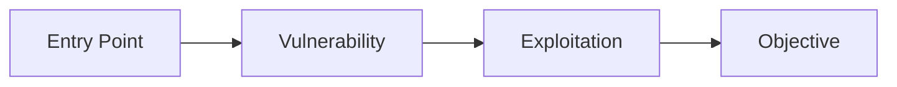

# 🎯 [Room Name]

<div align="center">

**Challenge Overview**
| Attribute | Value |
|-----------|-------|
| **Target** | `[IP/File/URL]` |
| **Category** | [Web/Network/Forensics/Crypto/OSINT/RE/Pwn] |
| **Difficulty** | ⭐⭐⭐ |
| **Status** | 🔄 In Progress / ✅ Complete |
| **Time** | [Duration] |

</div>

---

## 🏆 Challenge Solutions

| Task | Question | Answer | Method |
|------|----------|--------|---------|
| **1** | [Question text or summary] | `answer` | [Brief approach] |
| **2** | [Question text or summary] | `flag{...}` | [Brief approach] |
| **3** | [Question text or summary] | `answer` | [Brief approach] |

---

## 🔍 Reconnaissance

**Initial Discovery:**
```bash
# Primary enumeration
[key discovery commands]
```

**Key Findings:**
- 🎯 **[Finding 1]:** [Description]
- 🎯 **[Finding 2]:** [Description]
- 🎯 **[Finding 3]:** [Description]

**Attack Surface:**


---

## 🧪 Lab Environment

**Setup Commands:**
```bash
# Environment preparation
export TARGET=[IP/File/URL]
export LHOST=[Your IP]
export LPORT=[Your Port]

# Quick aliases for this session
alias target='[common command for this challenge]'
alias scan='[frequently used scan command]'
```

**File Organization:**
```
challenge_workspace/
├── 📁 reconnaissance/     # Scan outputs, enumeration data
├── 📁 exploitation/       # Payloads, exploits, scripts
├── 📁 evidence/          # Screenshots, flags, proof
└── 📁 tools/             # Custom scripts for this challenge
```

---

## ⚡ Exploitation Chain

### Phase 1: Initial Access
```bash
# Commands for initial foothold
[working commands]
```
**Result:** [What was achieved]

### Phase 2: Privilege Escalation / Deep Analysis
```bash
# Commands for escalation or deeper investigation
[working commands]
```
**Result:** [What was achieved]

### Phase 3: Objective Achievement
```bash
# Final commands to complete objectives
[working commands]
```
**Result:** [Flags obtained / Goals completed]

---

## 🛠️ Tools & Techniques

**Primary Tools:**
- **[Tool 1]** - [Specific use case]
- **[Tool 2]** - [Specific use case]
- **[Tool 3]** - [Specific use case]

**Key Technique:** [Main methodology that led to success]

---

## 💎 Critical Information

**Credentials:**
```
username:password - [source/service]
user2:hash - [context]
```

**Important Files/Paths:**
```
/path/to/important/file - [description]
/another/critical/path - [purpose]
```

**Network Information:**
```
Service:Port - [details]
Vulnerability - [description]
```

---

## 🎯 Mental Model

**The "Aha!" Moment:**
> [Describe the exact moment when the solution clicked - this is golden for future reference]

**Thought Process:**
1. **Initial Hypothesis:** [What you first thought the challenge was about]
2. **Pivot Point:** [When and why you changed approach]  
3. **Solution Insight:** [The key realization that led to success]

**If I Did This Again:**
- **Start with:** [What you'd do first next time]
- **Skip:** [What was a waste of time]
- **Focus on:** [What was most important]

---

## 📚 Knowledge Base Update

**🧬 Core Concepts:**
- **[Concept 1]:** [Why it matters + when to use]
- **[Concept 2]:** [Real-world application]

**🔧 Technique Arsenal Updated:**
```bash
# New command learned
[command] --flag value  # [when to use this]

# Improved workflow  
[sequence of commands]  # [efficiency gain]
```

**⚠️ Red Flags Learned:**
- **[Indicator 1]** → Suggests [vulnerability/approach]
- **[Indicator 2]** → Usually means [specific condition]

**🎓 Skill Tree Progress:**
- **[Skill Area]**: Novice → Intermediate → **Advanced** ← Current
- **Next Challenge:** [Skill to develop] via [suggested room/practice]

---

## 📋 Quick Reference

**One-Liner Solution:**
```bash
[The most critical command that solved the challenge]
```

**Similar Challenges:**
- **[Room Name]** - [Why it's similar]
- **[Room Name]** - [Connection/similarity]

---

## 📊 Personal Assessment

| Metric | Rating | Notes |
|--------|--------|-------|
| **Technical Difficulty** | [X]/10 | [Reasoning] |
| **Learning Value** | [X]/10 | [What made it valuable] |
| **Enjoyment** | [X]/10 | [What was engaging] |
| **Recommendation** | ✅/❌ | [Would you recommend this room] |

---

## 🎖️ Achievement Summary

- ✅ **Completed:** [Date]
- 🕒 **Duration:** [Total time spent]
- 💡 **Hints Used:** [Number] / [Available]
- 🏆 **Success Rate:** [First attempt / Multiple attempts]

---

<div align="center">

**Template Version 2.0** | *Optimized for Professional Documentation*

</div>
